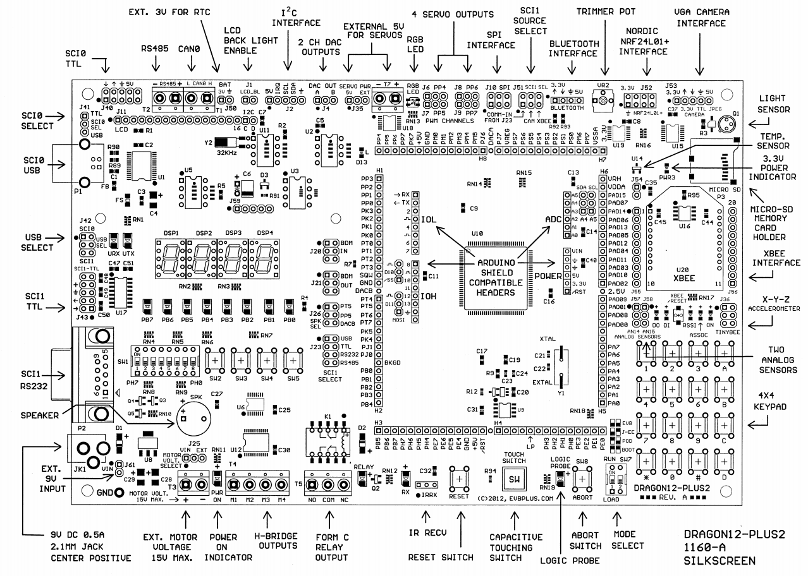
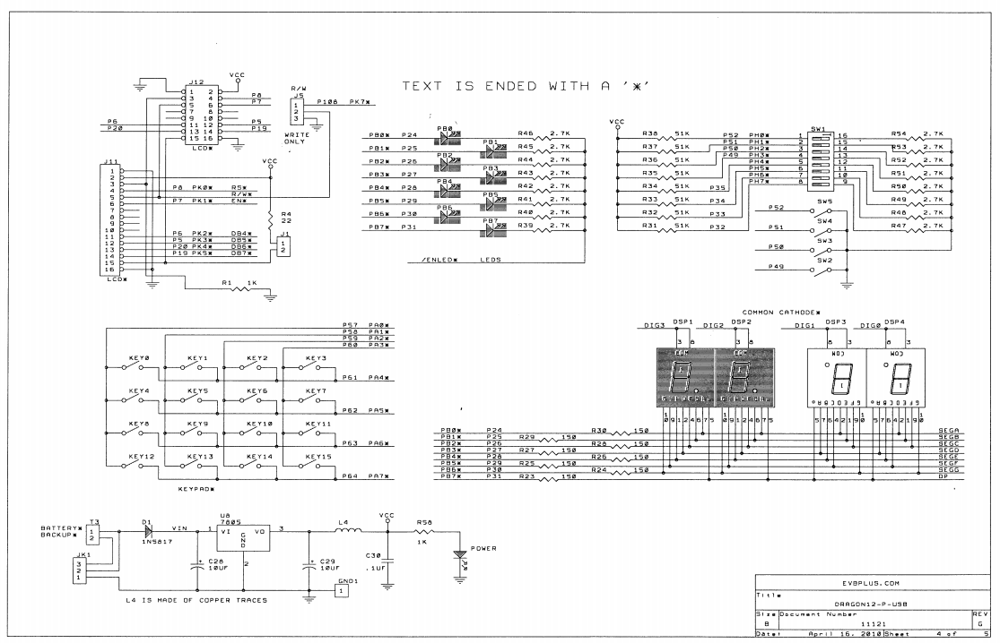
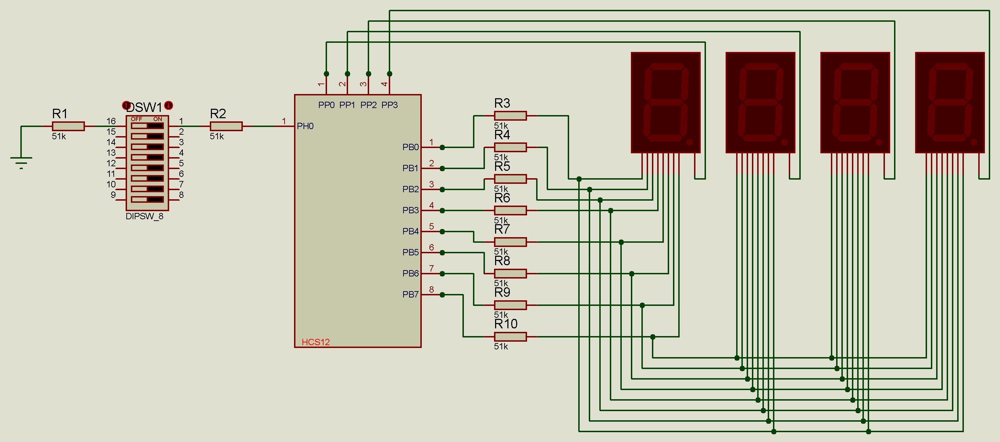

# Down Counter using HCS12 in Assembly Language

The objective of this project is to utilize the 7-segments display and DIP
switch interface with the HCS12 in the Dragon 12-plus.

### Hardware Configuration
|----------------------------------------|
|      |
|  |
|       |
|----------------------------------------|
 

### DDR Table

**DDRH: DIP Switch Input**

| PH7 | PH6 | PH5 | PH4 | PH3 | PH2 | PH1 | PH0 | HEX  |
| :-: | :-: | :-: | :-: | :-: | :-: | :-: | :-: | :--: |
|     |     |     |     |     |     |     | SW1 |      |
|  X  |  X  |  X  |  X  |  X  |  X  |  X  |  0  | \$00 |

**DDRB: 7-segments display output**

| PB7 | PB6 | PB5 | PB4 | PB3 | PB2 | PB1 | PB0 | HEX  |
| :-: | :-: | :-: | :-: | :-: | :-: | :-: | :-: | :--: |
| Dp  |  g  |  f  |  e  |  d  |  c  |  b  |  a  |      |
|  1  |  1  |  1  |  1  |  1  |  1  |  1  |  1  | \$FF |

**DDRP: 7-segments output**

| PP7 | PP6 | PP5 | PP4 | PP3 | PP2 | PP1 | PP0 | HEX  |
| :-: | :-: | :-: | :-: | :-: | :-: | :-: | :-: | :--: |
|  X  |  X  |  X  |  X  |  1  |  1  |  1  |  1  | \$0F |

 

### DR Table

**PTH: DIP switch (ACTIVE HIGH)**

| CONDITION | PH7 | PH6 | PH5 | PH4 | PH3 | PH2 | PH1 | PH0 | HEX  |
| :-------: | :-: | :-: | :-: | :-: | :-: | :-: | :-: | :-: | :--: |
|           |     |     |     |     |     |     |     | SW1 |      |
| Switch On |  X  |  X  |  X  |  X  |  X  |  X  |  X  |  1  | \$01 |

**PORTB: 7-segments display (COMMON CATHODE)**

| CONDITION | PB7 | PB6 | PB5 | PB4 | PB3 | PB2 | PB1 | PB0 | HEX  |
| :-------: | :-: | :-: | :-: | :-: | :-: | :-: | :-: | :-: | :--: |
|           | Dp  |  g  |  f  |  e  |  d  |  c  |  b  |  a  |      |
|     0     |  0  |  0  |  1  |  1  |  1  |  1  |  1  |  1  | \$3F |
|     1     |  0  |  0  |  0  |  0  |  0  |  1  |  1  |  0  | \$06 |
|     2     |  0  |  1  |  0  |  1  |  1  |  0  |  1  |  1  | \$5B |
|     3     |  0  |  1  |  0  |  0  |  1  |  1  |  1  |  1  | \$4F |
|     4     |  0  |  1  |  1  |  0  |  0  |  1  |  1  |  0  | \$66 |
|     5     |  0  |  1  |  1  |  0  |  1  |  1  |  0  |  1  | \$6D |
|     6     |  0  |  1  |  1  |  1  |  1  |  1  |  0  |  1  | \$7D |
|     7     |  0  |  0  |  0  |  0  |  0  |  1  |  1  |  1  | \$07 |
|     8     |  0  |  1  |  1  |  1  |  1  |  1  |  1  |  1  | \$7F |
|     9     |  0  |  1  |  1  |  0  |  1  |  1  |  1  |  1  | \$6F |

**PTP: 7-segments display (COMMON CATHODE)**

| CONDITION | PP7 | PP6 | PP5 | PP4 | PP3  | PP2  | PP1  | PP0  | HEX  |
| :-------: | :-: | :-: | :-: | :-: | :--: | :--: | :--: | :--: | :--: |
|           |     |     |     |     | DSP4 | DSP3 | DSP2 | DSP1 |      |
|  DSP1 ON  |  X  |  X  |  X  |  X  |  1   |  1   |  1   |  0   | \$0E |
|  DSP2 ON  |  X  |  X  |  X  |  X  |  1   |  1   |  0   |  1   | \$0D |

 

### MASKING TABLE

| PH7 | PH6 | PH5 | PH4 | PH3 | PH2 | PH1 | PH0 | HEX  |
| :-: | :-: | :-: | :-: | :-: | :-: | :-: | :-: | :--: |
|     |     |     |     |     |     |     | SW1 |      |
|  0  |  0  |  0  |  0  |  0  |  0  |  0  |  1  | \$01 |
